# Configuring Drupal 7 with the Search API Solr module

In this guide, we're going to cover the basics of setting up a websolr index to be used with [Drupal 7](https://drupal.org/drupal-7.22-release-notes) and the [Search API Solr](https://drupal.org/project/search_api_solr) module. A few points to note before we get started:

- This example uses Drupal 7.22 and Search API Solr version 7.x-1.1. Your versions may vary; as long as the major versions are the same, you can reliably use this guide.
- This guide is not meant to be an exhaustive tutorial on all of the things the Search API Solr module can do. The goal here is to get you up and running quickly, then let you tune things as necessary.
- If you run into issues while following this guide, make sure to check the "Troubleshooting" section at the bottom and see if a soluton is addressed there.

## Getting started

For the purposes of this tutorial, I set up a vanilla Drupal 7 install. I used the Devel module to generate 50 nodes of random content so we would have something to index later. After my dummy content was created, I uninstalled and removed this module. I then prepped the site by:

- Downloaded and extracted the following to `sites/all/modules`: [Search API](https://drupal.org/project/search_api), [Search API Solr](https://drupal.org/project/search_api_solr), [Entity](https://drupal.org/project/entity)
- Disabled the core Search module
- Optional: I downloaded and installed [Search API Pages](https://drupal.org/project/search_api_page). This isn't necessary, but you will need something to conduct the search. Per the [Search API developer](https://drupal.org/node/2051505): "The Search API module doesn't replace the core search functionality, and without additional modules there is no way offered for actually searching. If you are using the Search API (no matter whether with Solr or with another backend) it is suggested to deactivate core's "Search" module, as the Search API is designed to completely replace it and doesn't integrate with it or use it in any way." In short, if you don't use an existing module in the Search API space, you will need to write your own.

Other than that listed above, I did not add or change any modules/settings. Your situation is probably different, but it shouldn't matter at this point.

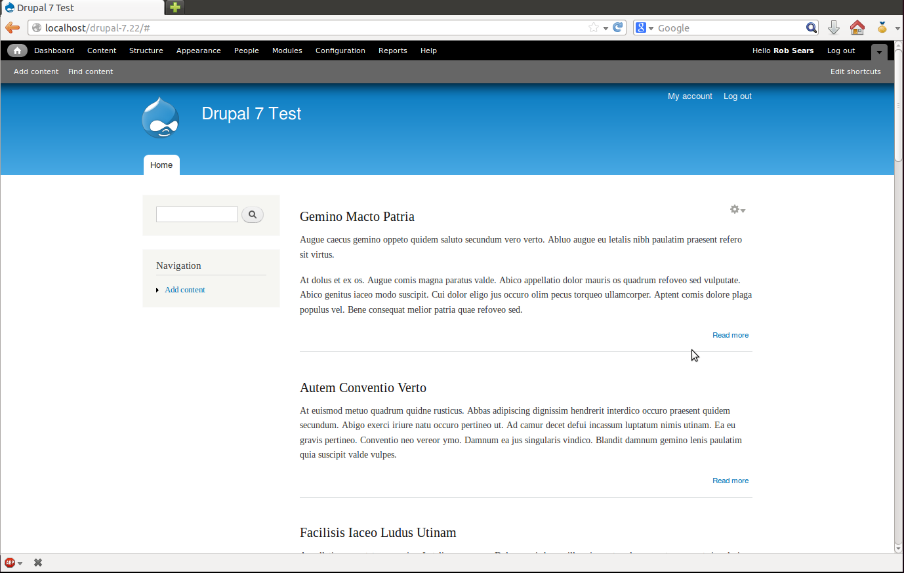

Make sure you navigate to `admin/modules` and verify that the Search API Solr module and its related modules have been activated:

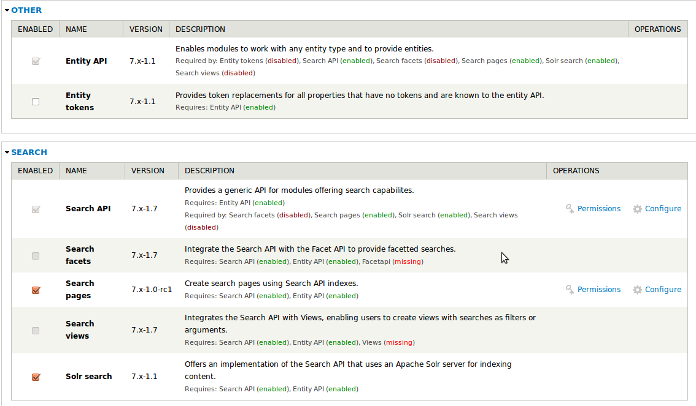

Make sure to disable the core Search module:

You will also need to make a slight modification to the Search API code. In the file `sites/all/modules/search_api_solr/includes/solr_connection.inc`, scroll down to line 328: `$response = $this->sendRawGet($url);` Basically, this part of the code pings websolr and asks for some administrative information. We protect the administrative interfaces for security reasons, so this fails. Frustratingly, users will receive a message about being unable to reach the Solr server... even while they can successfully index their documents. This problem can be fixed by changing this line to: `$response = (object) array('data' => '');`, which basically tells the module "Yes! I reached the server, but I have nothing to report."

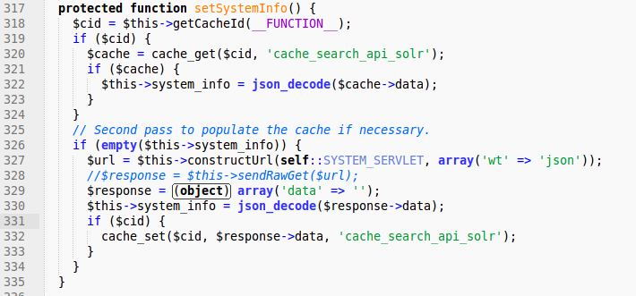

Great! That's all you need to get started. Next, we'll configure the websolr index that will hold your documents.

## Setting up the websolr index

Next, you'll want to [add a new slice](https://websolr.com/slices/new) to your websolr account. Give your index a descriptive name, select the server group nearest to your application, then select "Drupal Search API Solr 7.x-1.1":

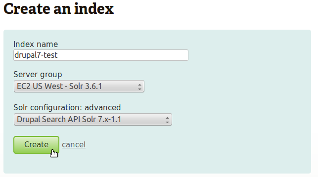

When this form has been filled out, go ahead and click "Create." Afterwards, you will be redirected to a page that shows the status of your index and will probably show a message about taking a few minutes to complete:

This is usually finished within a few minutes, so take a short break. When you come back, hit refresh to see the following:

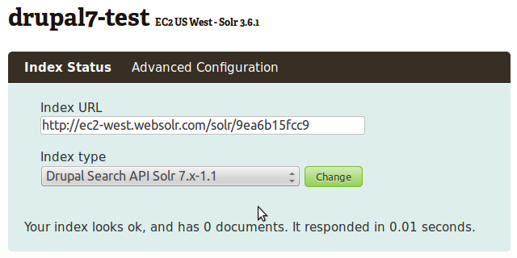

If you see a message that says your index looks ok, you're done. Occasionally provisioning errors will occur and you will see a message about taking a long time to provision your index. Try appending "/refreshing" to the page's URL and give it a minute or two. If that doesn't clear things up, you will need to open a [support ticket](http://help.websolr.com) and have the Support Team take a closer look.

## Setting up the Search API Solr Module

Once your websolr index is up and running, it's time to configure the Search API Solr module. Navigate to `admin/config/search/search_api` and you should see something like this:

The first step to configuring Search API Solr is to tell the module about your websolr server. Click on the link marked "Add Server" and give your your server a helpful name and description. Select "Solr service" from the "Service class" dropdown and fill out the information as below (leave the "Basic HTTP Authentication" and "Advanced" fields alone):

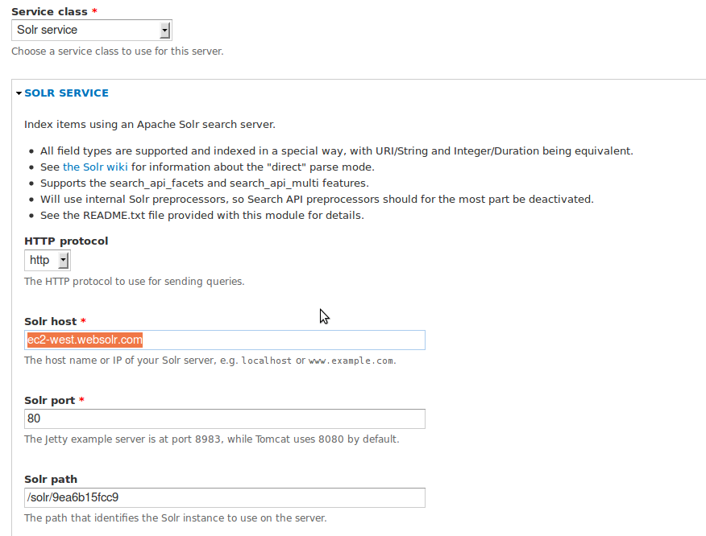

Click "Create server." If everything was input correctly, you should see something like this:

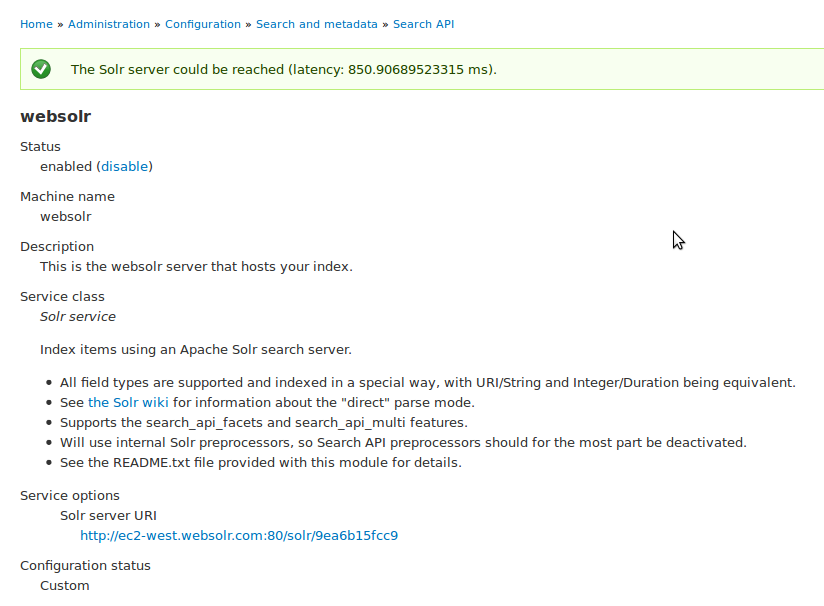

Now, return to `admin/config/search/search_api` We need to add a new index; we can do so by clicking on the "Add index" link and using the following information in the subsequent form:

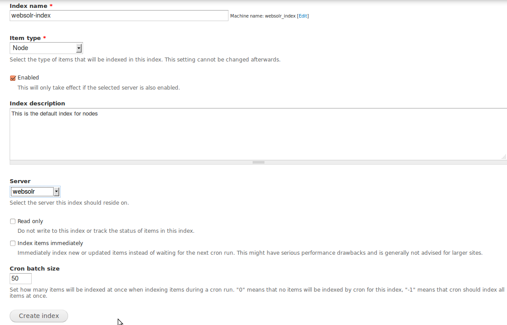

Keep in mind that this tutorial is not going to cover all of the possible configurations. You will need to evaluate your needs and adapt the above settings as necessary. As it stands, this tutorial will involve indexing nodes only. Once you have saved the index, you should see something like this:

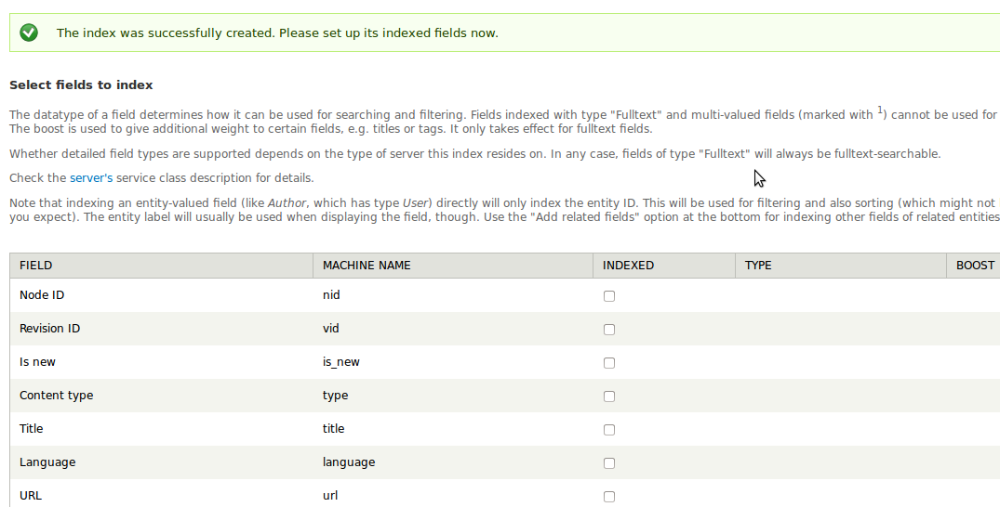

Again, we're not going to cover everything. Just enough to get our basic search up and running. I made the following selections to get the basic node elements indexed, but you will need to evaluate which fields are important for your specific application. Fortunately, if you make a mistake or want to change things later, you can do so:

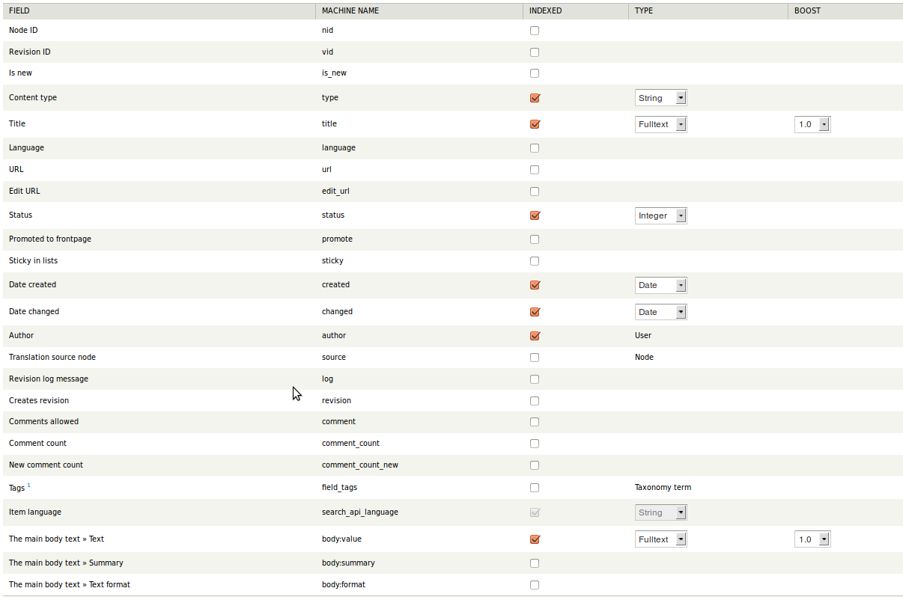

Once you have configured your fields for the index, save your progress and you will see something like this:

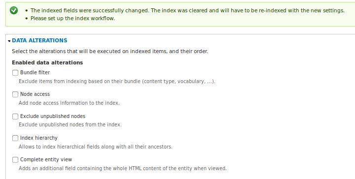

You don't strictly need to do anything with the workflow here. I didn't make any changes on the demo site, but feel free to make whatever tweaks are necessary for your app. You may want to save any of these changes for later though, AFTER you have successfully indexed and searched documents. That will help you narrow down your troubleshooting if necessary.

Now, navigate back to `admin/config/search/search_api` and click on Edit > Status for the websolr index that you have created. You should see this:

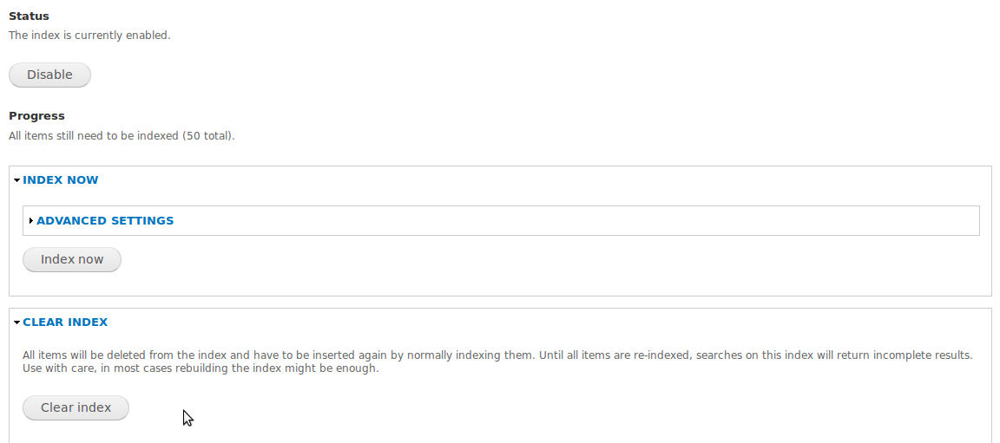

Leave the advanced settings alone and simply click on "Index now." That will send all of your nodes to the new websolr index. You should get a neat little progrss bar along the way. Once the indexing operation has completed, you should get a message like this:

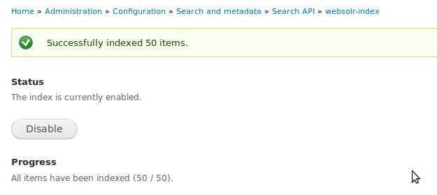

If you got any error messages, go back and check your settings. As a last step, I would recommend returning to `admin/config/search/search_api` and deleting the "Default node index" that came bundled with the module if you have not already done so. This is optional, but it will give a cleaner interface in my opinion.

## Setting up the Search API Pages Module (optional)

The Search API module does NOT provide any out of the box searching capabilities. Rather, it provides an API for other modules to simplify their own Solr searching. This means that you will either need to write your own module, tailored to your specific needs, or you will need to use an existing module. In this tutorial, I am using Search API Pages to provide a search page. This is optional for you, but it is a good tool to use at first because it will help you verify that everything is working.

From `admin/config/search/search_api`, click on the "Search Pages" tab, then click on the "Add search page" link. Alternatively, you could simply navigate to `admin/config/search/search_api/page/add`. Fill out a form like this:

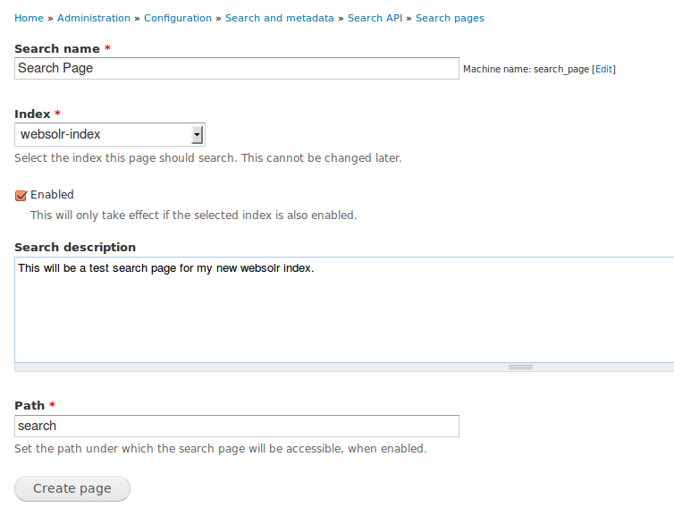

Once you have created the page, you will be able to customize how the query is processed and how the results are returned. You can pretty much just leave the defaults here:

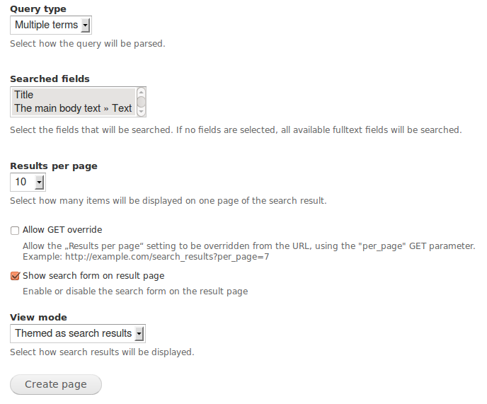

Click on "Create Page" and you should get a message like this:

## Checking on your index

After the Search API Solr module has indicated a successful indexing of your documents, you can navigate to your websolr URL and append "/select" to it. For me, this was `http://ec2-west.websolr.com/solr/9ea6b15fcc9/select` This will return the first set of documents in your index. If you don't see them right away after indexing, don't worry. For reasons of network performance and stability, all websolr indices have a 60 second commit time. This means your documents can take up to 60 seconds to show up in your index; if you don't see them right away, just wait a minute, then hit refresh:

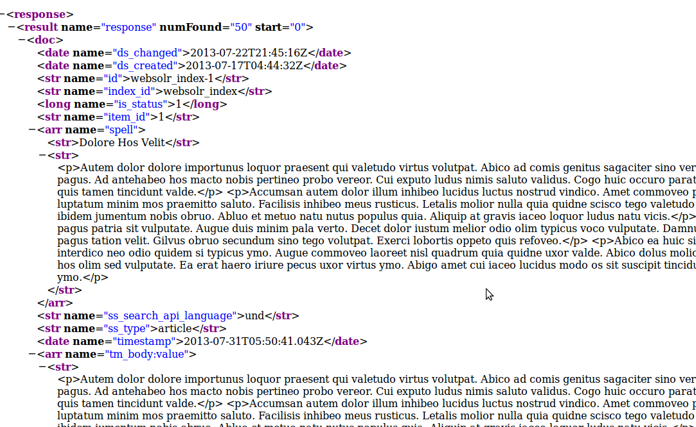

You can also look at the slice summary, which will indicate the status of your index and how many documents are present:

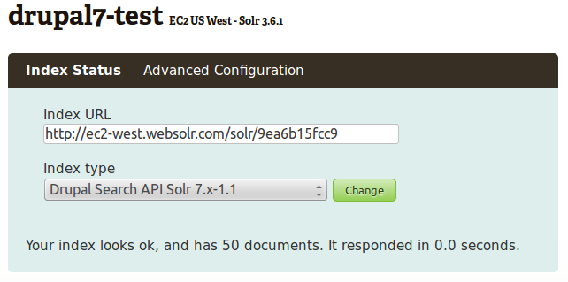

To test Drupal, pick out a keyword that you can see in your index. Since my nodes were all randomly-generated, I grabbed the word "dolor" because it seemed to come up a few times. Go to your Drupal search (if you created a Search Page in the previous section, navigate there) and enter your chosen keyword. If everything is configured correctly, you should get a set of results:

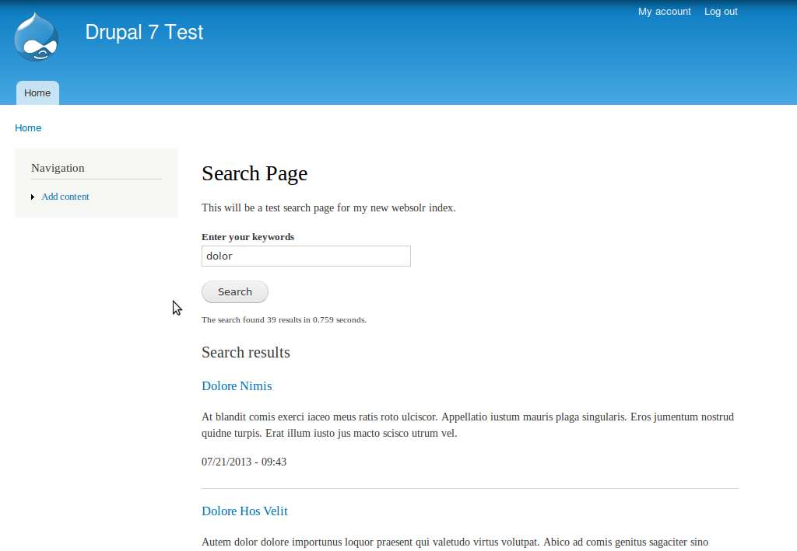

## Troubleshooting

### I get a 401 Unauthorized error when I try to index my documents ###

You have probably enabled authorization on this index. Making changes (writes, updates, deletes) to your index requires that your HMAC key be included in the request header. The Search API Solr module does not have the capability of crafting a request in this way. There are three solutions: disable advanced authorization, hack the module to include the HMAC header and hard-code your key, or write a patch for the module that adds this cabability for end users and submit it to the maintainer for consideration.
